<h1 align="center">
  
  𝐇𝐞𝐥𝐥𝐨, &lt;𝚌𝚘𝚍𝚎𝚛𝚜/&gt;!
  
  
</h1>

 
 

- 🔭 𝙸’𝚖 𝚌𝚞𝚛𝚛𝚎𝚗𝚝𝚕𝚢 𝚠𝚘𝚛𝚔𝚒𝚗𝚐 𝚘𝚗 **𝙳𝚊𝚝𝚊 𝚂𝚌𝚒𝚎𝚗𝚌𝚎, 𝙴𝚖𝚋𝚎𝚍𝚍𝚎𝚍 𝚂𝚢𝚜𝚝𝚎𝚖, 𝙲𝚘𝚖𝚙𝚞𝚝𝚎𝚛 𝙶𝚛𝚊𝚙𝚑𝚒𝚌𝚜 + 𝚅𝚒𝚜𝚒𝚘𝚗, 𝙼𝚊𝚌𝚑𝚒𝚗𝚎 𝙻𝚎𝚊𝚛𝚗𝚒𝚗𝚐.**
- 📖 𝙸’𝚖 𝚌𝚞𝚛𝚛𝚎𝚗𝚝𝚕𝚢 𝚕𝚎𝚊𝚛𝚗𝚒𝚗𝚐 **𝙰𝙶𝙸, 𝙳𝚎𝚟𝙾𝚙𝚜, 𝙲𝚘𝚖𝚙𝚎𝚝𝚒𝚝𝚟𝚎 𝙿𝚛𝚘𝚐𝚛𝚊𝚖𝚖𝚒𝚗𝚐.**
- 🔗 𝙸’𝚖 𝚕𝚘𝚘𝚔𝚒𝚗𝚐 𝚝𝚘 𝚌𝚘𝚕𝚕𝚊𝚋𝚘𝚛𝚊𝚝𝚎 𝚘𝚗 **𝙲𝚘𝚖𝚙𝚞𝚝𝚎𝚛 𝙶𝚛𝚊𝚙𝚑𝚒𝚌𝚜 + 𝚅𝚒𝚜𝚒𝚘𝚗, 𝙼𝚊𝚌𝚑𝚒𝚗𝚎 𝙻𝚎𝚊𝚛𝚗𝚒𝚗𝚐, 𝙰𝙶𝙸.**
- ❓ 𝙰𝚜𝚔 𝙼𝚎 𝙰𝚋𝚘𝚞𝚝 𝙰𝚗𝚢𝚝𝚑𝚒𝚗𝚐 [here](https://github.com/0YJ/0YJ/issues/) ! 𝙸 𝚊𝚖 𝚑𝚊𝚙𝚙𝚢 𝚝𝚘 𝚑𝚎𝚕𝚙.
- 💖 𝙷𝚘𝚋𝚋𝚒𝚎𝚜 : **𝙲𝚘𝚖𝚙𝚞𝚝𝚎𝚛 𝚑𝚊𝚛𝚍𝚠𝚊𝚛𝚎, 𝚖𝚎𝚌𝚑𝚊𝚗𝚒𝚌𝚜, 𝚏𝚒𝚝𝚗𝚎𝚜𝚜, 𝚛𝚘𝚌𝚔 𝚖𝚞𝚜𝚒𝚌.**
- ㊙️ 𝙲𝚛𝚎𝚎𝚍 : **𝙺𝚎𝚎𝚙 𝚈𝚘𝚞𝚛 𝙷𝚊𝚌𝚔𝚎𝚛 𝚂𝚙𝚒𝚛𝚒𝚝! 𝚃𝚑𝚒𝚗𝚔 𝚘𝚞𝚝𝚜𝚒𝚍𝚎 𝚝𝚑𝚎 𝚋𝚘𝚡, 𝚝𝚞𝚛𝚗 𝚝𝚑𝚎 𝚒𝚖𝚙𝚘𝚜𝚜𝚒𝚋𝚕𝚎 𝚒𝚗𝚝𝚘 𝚙𝚘𝚜𝚜𝚒𝚋𝚕𝚎, 𝚊𝚗𝚍 𝚜𝚑𝚊𝚛𝚎 𝚠𝚑𝚊𝚝 𝚢𝚘𝚞 𝚔𝚗𝚘𝚠.**

 
 

  <!--  •  --> 
   •   
  •
  •
   •
   •
  

<!-- 

 

  <code>
    
  </code>

 -->

<!--  
  
  
   

-->

#
<g-emoji class="g-emoji" alias="chart_with_upwards_trend" fallback-src="https://github.githubassets.com/images/icons/emoji/unicode/1f4c8.png">📈</g-emoji> **𝙻𝙰𝙽𝙶𝚄𝙰𝙶𝙴𝚂 𝙰𝙽𝙳 𝚃𝙾𝙾𝙻𝚂:**  

 
 

<code></code>
<code></code>
<code></code>
<code></code>
<code></code>
<code></code>
<code></code>
<code></code>
<code></code>
<code></code>
<code></code>
<code></code>
<code></code>
<code></code>

#

<code></code>
<code></code>
<code></code>
<code></code>
<code></code>
<code></code>
<code></code>
<code></code>
<code></code>
<code></code>
<code></code>
<code></code>
<code></code>
<code></code>

 

#

  <g-emoji class="g-emoji" alias="chart_with_upwards_trend" fallback-src="https://github.githubassets.com/images/icons/emoji/unicode/1f4c8.png">📈</g-emoji>
  <strong>𝙶𝚒𝚝𝚑𝚞𝚋 𝚂𝚝𝚊𝚝𝚜 : </strong>

 

  
  

 

 

#

    
  <h4 align="center"><code>📊 𝙶𝚒𝚝𝙷𝚞𝚋 𝙼𝚎𝚝𝚛𝚒𝚌𝚜</code></h4>

  
  
  

<h1>
  Connect With Me
  
</h1>

   
  <a href="https://www.linkedin.com/in/0YJ/" target="_blank">
    <code></code>
  </a>
  <a href="https://www.facebook.com/jayant.goel.12/" target="_blank">
    <code></code>
  </a>
  <a href="https://www.instagram.com/0YJ/" target="_blank">
    <code></code>
  </a>
  <a href="https://twitter.com/0YJ" target="_blank">
    <code></code>
  </a>
  <a href="https://dev.to/0YJ">
    <code></code>
  </a>     

 

  <a href="https://www.hackerrank.com/0YJ/" target="_blank">
    <code></code>
  </a>

  <a href="http://www.codeforces.com/profile/0YJ" target="_blank">
    <code></code>
  </a>

  <a href="https://www.hackerearth.com/@0YJ" target="_blank">
    <code></code>
  </a>

  <a href="https://www.codechef.com/users/yjzh" target="_blank">
    <code></code>
  </a>
  
  <a href="https://leetcode.com/0YJ/" target="_blank">
    <code></code>
  </a>

 
 

### 𝚂𝚑𝚘𝚠 𝚜𝚘𝚖𝚎 ❤️ 𝚋𝚢 𝚜𝚝𝚊𝚛𝚛𝚒𝚗𝚐 𝚜𝚘𝚖𝚎 𝚘𝚏 𝚝𝚑𝚎 𝚛𝚎𝚙𝚘𝚜𝚒𝚝𝚘𝚛𝚒𝚎𝚜!

#

   
  
    

-----

**Credits**: [0YJ](https://github.com/0YJ)

**Last Edited on**: 2026-02-19
